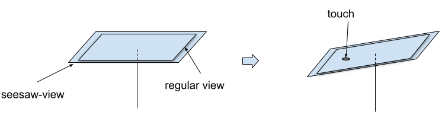

# seesaw-view

A view container that gives visual feedback by sessawing a view.

## Basic idea

Since flat views like `ImageView` with a click-handler do not give visual feedback when user clicks on them, the seesaw-view provides a container, that seesaws the view „into the screen“ where the user touches it.

## Background

The view is a plane that is on an imaginary stick as seen on this illustration.

